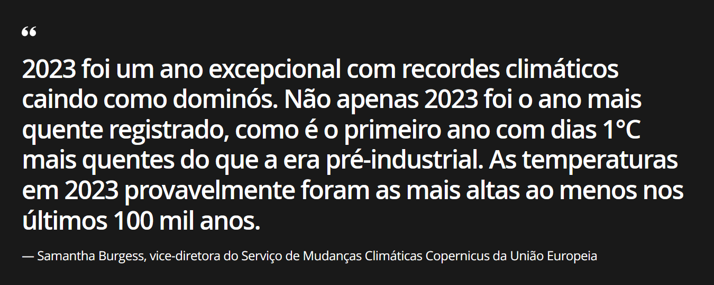

```{r, echo = FALSE, results='hide', message=FALSE}
library(tidyverse)
library(ggplot2)
library(scales)
library(dplyr)
library(viridis)
library(reshape2)
library(knitr)
library(zoo)
library(ggdark)
```


```{r, echo = FALSE}
df <- read.csv("./dados/mudanca_climatica.csv", header = TRUE)
dfw <- read.csv("./dados/mudanca_climatica_mundo.csv", header = TRUE)
dfl <- read.csv("./dados/mudanca_climatica_list.csv", header = TRUE)
```


```{r}
dark_theme <- dark_theme_light() +
  theme(plot.background = element_rect(fill = "#191919"),
        panel.background = element_blank())

dark_theme_22 <- dark_theme_light(base_size = 22) +
  theme(plot.background = element_rect(fill = "#191919"),
        panel.background = element_blank())
```

## Como as mudanças climáticas têm moldado o mundo nos últimos anos?

:::: {.r-hstack .justify-center}
{fig-align="center" width="90%"}
::::

##

:::: {.r-hstack .justify-center}
{fig-align="center" width="90%"}
::::

## Políticas Mundiais

::::: {.custom__list-group}
- Convenção-Quadro da ONU sobre Mudança do Clima – ONU, 1992.
- Protocolo de Quito – Japão, 1997.
- Acordo de Paris - França, 2005.
- Política Nacional sobre Mudança do Clima – Brasil, 2009.
:::::


## Objetivos

::::: {.custom__list-group}
:::: {.fragment .blur}
1. Análise Anual de Temperaturas:

::: {.custom__sub-item}
  - Investigar a variação anual das temperaturas no Brasil.
  - Identificar padrões de aumento ou diminuição ao longo deste período.
:::
::::

:::: {.fragment .blur}
2. Variações Sazonais:

::: {.custom__sub-item}
  - Examinar as variações sazonais no Brasil.
  - Analisar as estações do ano para compreender as nuances climáticas específicas de cada uma.
:::
::::

:::: {.fragment .blur}
3. Contextualização Global:

::: {.custom__sub-item}
  - Situar as análises em um contexto global.
  - Comparar as tendências observadas no Brasil com as mudanças climáticas mundiais.
:::
::::
:::::

## Metodologia

::::: {.custom__list-group}
:::: {.fragment .blur}
- Dados obtidos de FAOSTAT (base de dados estatísticos mantida pela FAO -- Food and Agriculture Organization).
- Uma das agências da ONU para a Alimentação e a Agricultura.
- Origem é o GISTEMP -- Banco de Dados de Temperatura Global da NASA.
::::

:::: {.fragment .blur}
- Abrange o período de 1961 a 2022.
- Período base entre 1951 e 1980.
::::
:::::

## Amostra

```{r, results='asis'}
database_simplified <- df[c(1:4, (nrow(df) - 1):nrow(df)),
                          c(1, 2, 3, 4, 15, 16, 17, 18)]
database_simplified[3,] <- "..."
database_simplified[, 4] <- "..."
kable(
  database_simplified,
  col.names = c("Ano", "Jan", "Fev", " ", "Mar-Mai", "Jun-Ago", "Set-Nov", "Anual"),
  align = "r"
)
```

## Análise Descritiva {transition="zoom-in fade-out"}

#### Temperatura média anual no Brasil {.custom__text-center}

::: {.r-hstack .custom__solo-chart}
```{r, echo = FALSE}
#| fig-width: 20
#| fig-height: 10
#| fig-align: 'center'
#| echo: false

p <-
  ggplot(df,
         aes(x = Year, y = Meteorological.year, fill = Meteorological.year)) +
    geom_bar(stat = "identity",
             color = ifelse(df$Meteorological.year < 0, "gray60", NA)) +
    scale_fill_viridis(option = "H") +
    labs(x = "Ano",
         y = "Variação em °C") +
    dark_theme_22 +
    labs(fill = "Variação") +
    scale_x_continuous(breaks = seq(1960, 2020, 5)) +
    theme(axis.text = element_text(size = 20))
p
```
:::

## Análise Descritiva

#### Temperatura média anual no Brasil {.custom__text-center}

::::: {.columns .r-hstack .justify-center}

::: {.column width="50%" .r-hstack .justify-center}
```{r, echo = FALSE}
p + dark_theme
```
:::

:::: {.column width="50%" .custom__list-group}
::: {.fragment .blur}
1. Tendência ascendente no gráfico.
:::

::: {.fragment .blur}
2. Indicação de aumento consistente nas temperaturas.
:::

::: {.fragment .blur}
3. Padrão que sugere uma mudança significativa no clima ao longo de seis décadas.
:::
::::
:::::

## Análise Descritiva {transition="zoom-in fade-out"}

#### Temperatura média sazonal no Brasil {.custom__text-center}

::: {.r-hstack .custom__solo-chart}
```{r, echo = FALSE}
#| fig-width: 20
#| fig-height: 10
#| fig-align: 'center'
#| echo: false

p <- ggplot(df, aes(Year)) +
  geom_line(aes(y = Meteorological.year, colour = "Anual"), size = 1) +
  geom_line(aes(y = Dec.Jan.Feb, colour = "Dez-Fev"), size = 0.75) +
  geom_line(aes(y = Mar.Apr.May, colour = "Mar-Mai"), size = 0.75) +
  geom_line(aes(y = Jun.Jul.Aug, colour = "Jun-Ago"), size = 0.75) +
  geom_line(aes(y = Sep.Oct.Nov, colour = "Set-Nov"), size = 0.75) +
  geom_line(aes(y = 0), col = "lightgray") +
  labs(x = "Ano",
       y = "Variação em °C") +
  dark_theme_22 +
  labs(color = '') +
  scale_x_continuous(breaks = seq(1960, 2020, 5))
p
```
:::

## Análise Descritiva

#### Temperatura média sazonal no Brasil {.custom__text-center}

::::: {.columns .r-hstack .justify-center}

::: {.column width="50%" .r-hstack .justify-center}
```{r, echo = FALSE}
p + dark_theme
```
:::

:::: {.column width="50%" .custom__list-group}
::: {.fragment .blur}
1. Segue tendências consistentes em todas as estações.
:::

::: {.fragment .blur}
2. Não é possível identificar um evento específico ligado às estações responsável pelas mudanças climáticas observadas.
:::
::::
:::::

## Análise Descritiva {transition="zoom-in fade-out"}

#### Temperatura média anual global {.custom__text-center}

::: {.r-hstack .custom__solo-chart}
```{r, echo = FALSE}
#| fig-width: 20
#| fig-height: 10
#| fig-align: 'center'
#| echo: false

p <-
  ggplot(dfw,
         aes(x = Year, y = Meteorological.year, fill = Meteorological.year)) +
    geom_bar(stat = "identity",
             color = ifelse(dfw$Meteorological.year <= 0.001, "gray60", NA)) +
    scale_fill_viridis(option = "H") +
    labs(y = "Variação em °C",
         x = "Ano") +
    dark_theme_22 +
    labs(fill = "Variação") +
    scale_x_continuous(breaks = seq(1960, 2020, 5))
p
```
:::

## Análise Descritiva

#### Temperatura média anual global {.custom__text-center}

::::: {.columns .r-hstack .justify-center}

::: {.column width="50%" .r-hstack .justify-center}
```{r, echo = FALSE}
p + dark_theme
```
:::

:::: {.column width="50%" .custom__list-group}
::: {.fragment .blur}
1. Variação da temperatura média global apresenta tendência semelhante à observada no Brasil.
:::

:::: {.fragment .blur}
2. Não é uma tendência exclusivamente brasileira.
:::
::::
:::::

## Análise Descritiva

#### Variação da temperatura média anual no Brasil {.custom__text-center}

:::: {.fragment .blur}
Analisando a primeira e segunda derivadas temos:

```{r, echo = FALSE}
diff <- diff(df$Meteorological.year)
diff2 <- diff(diff)

kable(
  data.frame(
    "Derivada" = c("Primeira", "Segunda"),
    "Média" = c(mean(diff, na.rm = TRUE),
                mean(diff2, na.rm = TRUE)),
    "Mediana" = c(median(diff, na.rm = TRUE),
                  median(diff2, na.rm = TRUE))
  ),
  caption = "Média e mediana das derivadas",
  digits = 4,
  col.names = c("Derivada", "Média", "Mediana"),
  row.names = FALSE,
  align = "c",
  format.args = list(big.mark = ".",
                     decimal.mark = ",")

)
```
::::


::::: {.custom__list-group}
:::: {.fragment .blur}
1. A variação apresenta tendência de crescimento.
::::

:::: {.fragment .blur}
2. Aumento médio de $0{,}012\,^{\text{o}}\text{C}$ anuais.
::::

:::: {.fragment .blur}
3. Crescendo $0{,}002\,^{\text{o}}\text{C}$ anualmente.
::::
:::::

## Análise Descritiva

#### Distribuição {.custom__text-center}

:::: {.columns .r-hstack .justify-center}

::: {.column width="50%"}
```{r, echo = FALSE}
#| fig-width: 8
#| fig-height: 3
#| fig-align: 'center'

ggplot(data = melt(dfl), aes(x = Interval, y = value)) +
  geom_boxplot(aes(fill = Interval)) +
  labs(x = "",
       y = "Variação em °C") +
  dark_theme +
  labs(fill = '')
```
:::

::: {.column width="50%"}
```{r, echo = FALSE}
#| fig-width: 8
#| fig-height: 3
#| fig-align: 'center'

ggplot(data = dfl, aes(x = Value)) +
  geom_histogram(bins = 10,
                 colour = "gray",
                 fill = "royalblue") +
  facet_wrap(~Interval, nrow = 2) +
  labs(x = "Variação em °C",
       y = "Frequência") +
  dark_theme +
  theme(
    strip.background = element_rect(
      fill = "gray15",
      colour = "#191919",
      size = 0.5,
      linetype = "solid"
    ),
    strip.text = element_text(face = "bold", colour = "white")
  )
```
:::

::::

::::: {.custom__list-group}
:::: {.fragment .blur}
1. Os conjuntos analisados apresentam distribuição normal ou quasi-normal.
::::

:::: {.fragment .blur}
::: {.callout-tip}
## Teorema Central do Limite

A distribuição amostral da média de variáveis aleatórias independentes e identicamente distribuídas tende a uma distribuição normal à medida que o tamanho da amostra aumenta.
:::
::::
:::::

## Teste de hipóteses

O teste de hipóteses escolhido foi o teste t-student para variáveis independentes:

$$t = \frac{\bar x - \mu_0}{s/\sqrt{n}}$$

::::: {.custom__list-group}
:::: {.fragment .blur}
1. As amostras são i.i.d., com distribuição (quasi)normal.
::::

:::: {.fragment .blur}
2. O tamanho da amostra é pequeno (62 registros).
::::

:::: {.fragment .blur}
3. A variância da população é desconhecida.
::::
:::::

:::: {.fragment .blur}
::: {.callout-tip}
## Convergência

Para amostras com tamanho maior que $50$ ou $60$, a distribuição t é praticamente igual à distribuição normal.
:::
::::

## Teste de hipóteses

Tentaremos, portanto, responder às seguintes perguntas sobre a variação da temperatura, através de testes estatísticos:

::::: {.custom__list-group}
:::: {.fragment .blur}
1. Há uma tendência de aumento anual no Brasil?
::::

:::: {.fragment .blur}
2. Há uma tendência de aumento no Brasil durante o verão (Dez-Fev)?

3. Há uma tendência de aumento no Brasil durante o outono (Mar-Mai)?

4. Há uma tendência de aumento no Brasil durante o inverno (Jun-Ago)?

5. Há uma tendência de aumento no Brasil durante a primavera (Set-Nov)?
::::

:::: {.fragment .blur}
6. Há uma tendência de aumento anual global?
::::
:::::

## Teste de hipóteses

::::: {.columns .r-hstack .justify-center}

:::: {.column width="50%" .fragment .blur}
Parâmetros utilizados:

::: {.custom__list-group}
- $\alpha = 0{,}05$;
- $61$ graus de liberdade, e,
- Região crítica de $1{,}670$.
:::
::::

:::: {.column width="50%" .fragment .blur}
Hipóteses:

::: {.custom__list-group}
- $H_0$: $\mu = 0$
- $H_1$: $\mu > 0$
:::
::::
:::::

## Teste de hipóteses

```{r, echo = FALSE}
confidence_limit <- function(data) {
  n <- length(data)
  t <- qt(0.05 / 2, df = n - 1, lower.tail = F)
  t * sd(data) / sqrt(n)
}
```

```{r, echo = FALSE, results='hide', message=FALSE}
# Perguntas
# 1. Há uma tendência de aumento da temperatura média anual no Brasil?
# 2. Há uma tendência de aumento da temperatura média no Brasil no verão (Dez-Fev)?
# 3. Há uma tendência de aumento da temperatura média no Brasil no outono (Mar-Mai)?
# 4. Há uma tendência de aumento da temperatura média no Brasil no inverno (Jun-Ago)?
# 5. Há uma tendência de aumento da temperatura média no Brasil na primavera (Set-Nov)?
# 6. Há uma tendência de aumento da temperatura média anual no mundo?


N <- 62
alpha <- 0.05
regiao_critica <- qt(alpha, df = N - 1, lower.tail = F)

dados <- df$Meteorological.year
media_1 <- mean(dados)
desvio_padrao_1 <- sd(dados)
estatistica_t_1 <- (media_1 - 0) / (desvio_padrao_1 / sqrt(N))
valor_p_1 <- pt(estatistica_t_1, df = N - 1, lower.tail = F)
limite_confianca_1 <- confidence_limit(dados)
sprintf("(1) Rejeita H0? %s", valor_p_1 < regiao_critica)
sprintf(
  "(1) Limite de confiança: (%s, %s)",
  media_1 - limite_confianca_1,
  media_1 + limite_confianca_1
)

dados <- df$Dec.Jan.Feb
media_2 <- mean(dados)
desvio_padrao_2 <- sd(dados)
estatistica_t_2 <- (media_2 - 0) / (desvio_padrao_2 / sqrt(N))
valor_p_2 <- pt(estatistica_t_2, df = N - 1, lower.tail = F)
limite_confianca_2 <- confidence_limit(dados)
sprintf("(2) Rejeita H0? %s", valor_p_2 < regiao_critica)
sprintf(
  "(2) Limite de confiança: (%s, %s)",
  media_2 - limite_confianca_2,
  media_2 + limite_confianca_2
)

dados <- df$Mar.Apr.May
media_3 <- mean(dados)
desvio_padrao_3 <- sd(dados)
estatistica_t_3 <- (media_3 - 0) / (desvio_padrao_3 / sqrt(N))
valor_p_3 <- pt(estatistica_t_3, df = N - 1, lower.tail = F)
limite_confianca_3 <- confidence_limit(dados)
sprintf("(3) Rejeita H0? %s", valor_p_3 < regiao_critica)
sprintf(
  "(3) Limite de confiança: (%s, %s)",
  media_3 - limite_confianca_3,
  media_3 + limite_confianca_3
)

dados <- df$Jun.Jul.Aug
media_4 <- mean(dados)
desvio_padrao_4 <- sd(dados)
estatistica_t_4 <- (media_4 - 0) / (desvio_padrao_4 / sqrt(N))
valor_p_4 <- pt(estatistica_t_4, df = N - 1, lower.tail = F)
limite_confianca_4 <- confidence_limit(dados)
sprintf("(4) Rejeita H0? %s", valor_p_4 < regiao_critica)
sprintf(
  "(4) Limite de confiança: (%s, %s)",
  media_4 - limite_confianca_4,
  media_4 + limite_confianca_4
)

dados <- df$Sep.Oct.Nov
media_5 <- mean(dados)
desvio_padrao_5 <- sd(dados)
estatistica_t_5 <- (media_5 - 0) / (desvio_padrao_5 / sqrt(N))
valor_p_5 <- pt(estatistica_t_5, df = N - 1, lower.tail = F)
limite_confianca_5 <- confidence_limit(dados)
sprintf("(5) Rejeita H0? %s", valor_p_5 < regiao_critica)
sprintf(
  "(5) Limite de confiança: (%s, %s)",
  media_5 - limite_confianca_5,
  media_5 + limite_confianca_5
)

dados <- dfw$Meteorological.year
media_6 <- mean(dados)
desvio_padrao_6 <- sd(dados)
estatistica_t_6 <- (media_6 - 0) / (desvio_padrao_6 / sqrt(N))
valor_p_6 <- pt(estatistica_t_6, df = N - 1, lower.tail = F)
limite_confianca_6 <- confidence_limit(dados)
sprintf("(6) Rejeita H0? %s", valor_p_6 < regiao_critica)
sprintf(
  "(6) Limite de confiança: (%s, %s)",
  media_6 - limite_confianca_6,
  media_6 + limite_confianca_6
)

dft <- data.frame(
  "Pergunta" = c(1,
                 2,
                 3,
                 4,
                 5,
                 6),
  "Intervalo" = c("Ano",
                  "Dez-Fev",
                  "Mar-Mai",
                  "Jun-Ago",
                  "Set-Nov",
                  "Global"),
  "Média" = c(media_1,
              media_2,
              media_3,
              media_4,
              media_5,
              media_6),
  "Desvio Padrão" = c(
    desvio_padrao_1,
    desvio_padrao_2,
    desvio_padrao_3,
    desvio_padrao_4,
    desvio_padrao_5,
    desvio_padrao_6
  ),
  "Estatística T" = c(
    estatistica_t_1,
    estatistica_t_2,
    estatistica_t_3,
    estatistica_t_4,
    estatistica_t_5,
    estatistica_t_6
  ),
  "Valor P" = c(
    valor_p_1,
    valor_p_2,
    valor_p_3,
    valor_p_4,
    valor_p_5,
    valor_p_6
  ),
  "Aceita H0?" = c(
    valor_p_1 > regiao_critica,
    valor_p_2 > regiao_critica,
    valor_p_3 > regiao_critica,
    valor_p_4 > regiao_critica,
    valor_p_5 > regiao_critica,
    valor_p_6 > regiao_critica
  ),
  "IC inferior" = c(
    media_1 - limite_confianca_1,
    media_2 - limite_confianca_2,
    media_3 - limite_confianca_3,
    media_4 - limite_confianca_4,
    media_5 - limite_confianca_5,
    media_6 - limite_confianca_6
  ),
  "IC superior" = c(
    media_1 + limite_confianca_1,
    media_2 + limite_confianca_2,
    media_3 + limite_confianca_3,
    media_4 + limite_confianca_4,
    media_5 + limite_confianca_5,
    media_6 + limite_confianca_6
  )
)

```

```{r}
kable(
  dft,
  caption = "Resultados dos testes de hipótese",
  digits = 3,
  align = "c",
  booktabs = T,
  col.names = c(
    "Pergunta",
    "Intervalo",
    "Média",
    "Desvio Padrão",
    "Estatística T",
    "Valor P",
    "Aceita H0?",
    "IC inferior",
    "IC superior"
  ),
  row.names = F,
  format.args = list(big.mark = ".",
                     decimal.mark = ",")
)
```


::: {.r-hstack .justify-end .custom__text-small}
_* $\alpha = 0{,}05$ e região crítica de $1{,}670$_
:::

## Teste de hipóteses {transition="zoom-in fade-out"}

### Intervalos de confiança {.custom__text-center}

::: {.r-hstack .custom__solo-chart}
```{r, echo = FALSE}
#| fig-width: 10
#| fig-height: 5
#| fig-align: 'center'
#| echo: false

dft$Intervalo <-
  factor(dft$Intervalo, levels = unique(dft$Intervalo))
ggplot(data = dft,
       aes(x = Intervalo, y = Média)) +
  geom_bar(
    aes(x = Intervalo, y = Média),
    stat = "identity",
    fill = "royalblue",
    width = 0.5,
  ) +
  geom_errorbar(
    aes(
      x = Intervalo,
      y = Média,
      ymin = IC.inferior,
      ymax = IC.superior
    ),
    colour = "lightblue",
    linewidth = 1.5,
    width = 0.1,
  ) +
  scale_y_continuous(breaks = breaks_pretty()) +
  dark_theme_22 +
  labs(x = "",
       y = "Variação em °C")
```
:::

::: {.r-hstack .justify-end .custom__text-small}
_* $\alpha = 0{,}05$_
:::

## Teste de hipóteses

### Resultados {.custom__text-center}

Com $95\%$ de confiança, rejeitam-se **TODAS** as hipóteses nulas, portanto:

::::: {.custom__list-group}
:::: {.fragment .blur}
1. Há fortes evidências de ter ocorrido um aumento na variação da temperatura média de todos os intervalos estudados.
::::

:::: {.fragment .blur}
2. Isso é corroborado pelos intervalos de confiança, que mostra que $0$ não é um valor provável para a média da variação.
::::
:::::

## Implicações e Conclusões Finais

Em síntese:

::::: {.custom__list-group}
:::: {.fragment .blur}
1. Deve haver um aumento anual na temperatura registrada no Brasil.
::::

:::: {.fragment .blur}
2. Há um aumento significativo nas temperaturas de todas as estações.
::::

:::: {.fragment .blur}
3. As maiores variações ocorreram nos períodos do verão e outono.
::::

:::: {.fragment .blur}
4. Tudo indica que é um fenômeno global.
::::
:::::

:::: {.r-hstack .justify-center}
::: {.fragment .fade-up}
{fig-align="center" width="500"}

###### Agradecemos pela atenção! {.custom__text-center}
:::
::::
